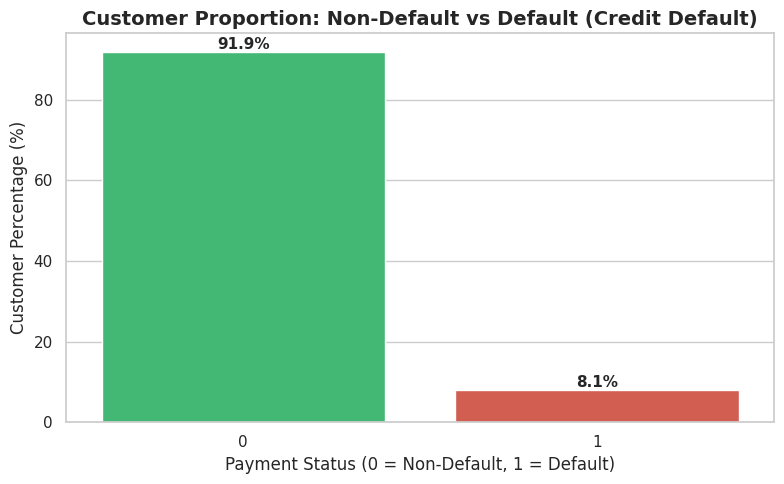
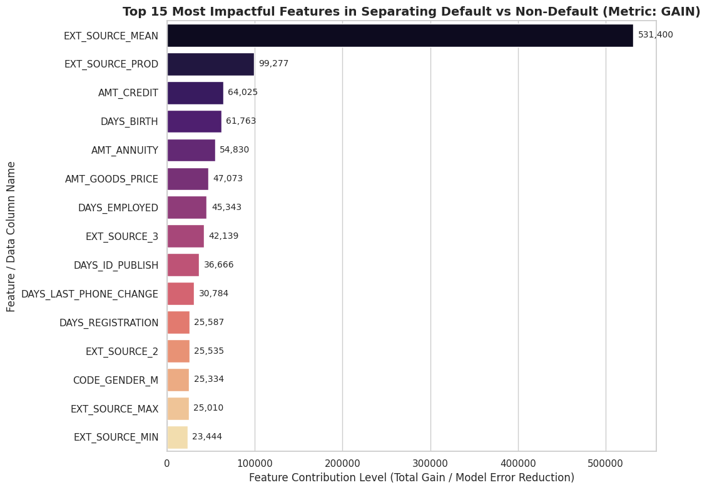
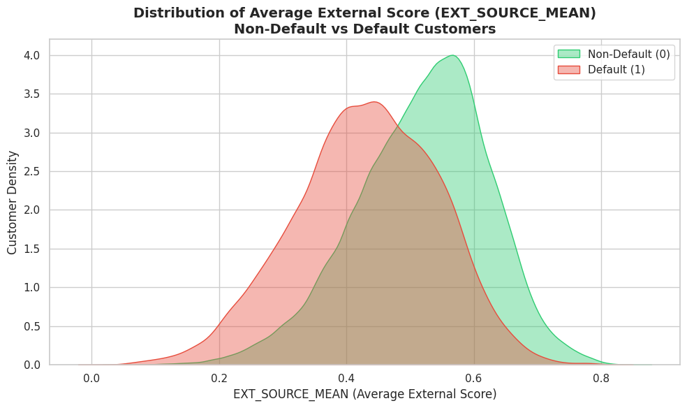
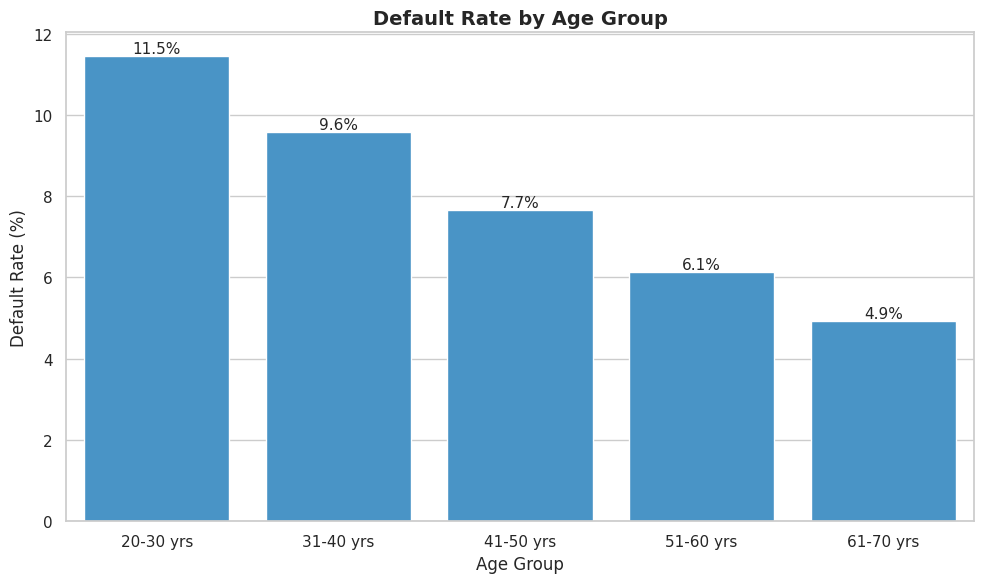
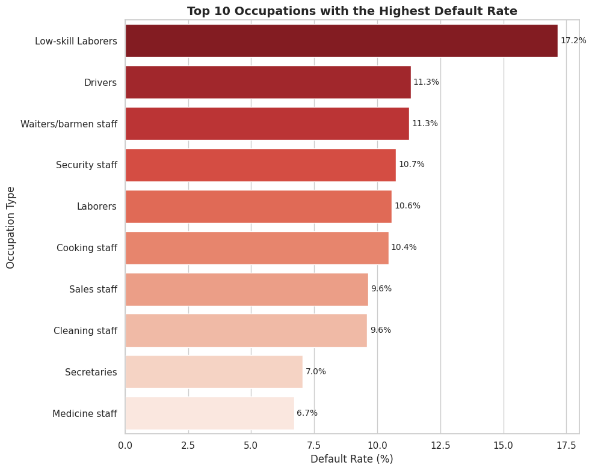
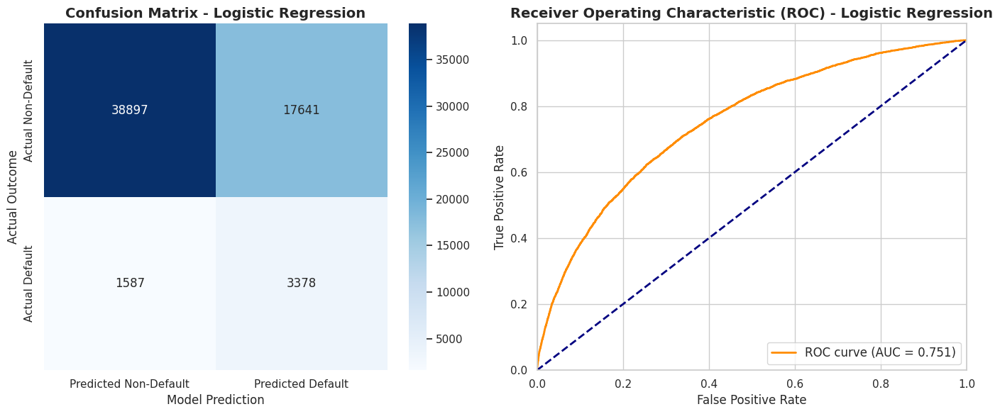

# Credit Risk Prediction: Balancing Financial Inclusion and Risk Mitigation

## 📖 Project Background

PT Home Credit Indonesia is a multinational consumer finance company serving over 3.4 million customers. A major bottleneck in the current credit evaluation system is the high rate of False Positives—incorrectly rejecting potential customers who are actually eligible and capable of repaying loans.

This inefficiency causes massive revenue leakage. As a Data Scientist, my objective is to build an optimized classification model (comparing Logistic Regression vs. LightGBM) to significantly reduce False Positives. This ensures fairer credit assessments, maximizes loan approvals, and effectively mitigates default risks.

### Project Links

- [Predictive Modeling Notebook](https://colab.research.google.com/drive/1JKEsajlCfY9ByIKqxSAwWpO-LaI4JQ2h?usp=sharing)

## 📊 Executive Summary & Data Overview

LightGBM emerged as the superior model for handling the highly imbalanced historical loan dataset. While the vast majority of applicants are good borrowers, making it challenging for standard models to detect defaulters, our optimized model successfully navigated this without falsely rejecting good customers.

Bottom-line Impact: By upgrading the model to LightGBM, the company effectively captures the 8.1% high-risk customers while drastically reducing the false rejection of the 91.9% good customers. This directly translates to millions in secured interest revenue that would have otherwise been lost to competitors.

## 💡 Insights Deep Dive

### 1. The Core Driver of Default (External Bureau Scores)

The Data: The LightGBM Gain metric shows that external credit bureau scores (EXT_SOURCE_MEAN) dominate the model's decision-making process, vastly outperforming basic demographics like age or income. The distribution chart proves that customers with lower external scores have a significantly higher density of defaults.

The Insight: A customer's historical credit behavior outside of Home Credit is the absolute best predictor of their future behavior with Home Credit.

Business Impact (Efficiency & Cost): By using EXT_SOURCE_MEAN as the absolute primary filter (Auto-Reject or Auto-Approve rule), the company can drastically reduce manual underwriter review time and cut API data-fetching costs, speeding up the approval process from days to seconds.

### 2. High-Risk Customer Profiling (Age & Occupation)

The Data: Customers aged 20-30 years, as well as those working as Low-skill Laborers and Drivers (Blue-collar workers), exhibit the highest default rates compared to other segments.

The Insight: Younger demographics and blue-collar workers often have unstable income streams or lack financial literacy, making them highly vulnerable to economic shocks.

Business Impact (Profit Maximization): Blanket-rejecting this massive demographic hurts financial inclusion and sacrifices market share. Instead, the business should offer tailored, low-risk micro-loans with shorter tenors for this segment. This strategy safely monetizes a high-risk group while building their credit history for larger future loans.

### 3. Model Evaluation: Maximizing Good Loan Approvals

.png>)

The Data: Logistic Regression struggled with the imbalanced data, producing a high number of False Positives. In contrast, LightGBM maintained a strong ROC-AUC score, proving its superior capability in distinguishing between good and bad credit.

The Insight: Traditional linear models (Logistic Regression) are too rigid for complex financial data. Tree-based boosting algorithms (LightGBM) navigate imbalanced data much better, ensuring borderline good customers are not grouped with actual defaulters.

Business Impact (Revenue Rescue): Every False Positive represents a lost, profitable customer. By deploying LightGBM, the system minimizes these false rejections, rescuing thousands of eligible borrowers. This directly injects secured interest revenue into the company's portfolio while maintaining a strict cap on bad debt.

## 🎯 Actionable Recommendations

- **Optimize the Main Filter:** Shift the primary credit approval determinant from internal demographic profile factors (age/income) to external credit bureau scores (EXT_SOURCE_MEAN).
- **Implement Product Tiering:** Transform at-risk demographics (aged 20-30 & blue-collar) into profitable segments by offering introductory micro-loans. Gradually increase their credit limits as they demonstrate repayment discipline.
- **Deploy LightGBM to Production:** Replace the legacy Logistic Regression model with LightGBM to rescue revenue lost to False Positives while maintaining low inference latency.

## 🚀 Future Works

- **Behavioral Data Extraction:** Process secondary datasets (e.g., installments_payments.csv) to extract past behavioral features, such as Average Days Past Due, to capture dynamic repayment trends and further increase predictive accuracy.
- **Customer Segmentation Clustering:** Build separate ML models specifically for First-time Borrowers vs. Returning Customers to ensure even fairer risk assessments.
- **Advanced Ensembling:** Combine LightGBM with XGBoost or Neural Networks using stacking methods to squeeze out the maximum possible accuracy.